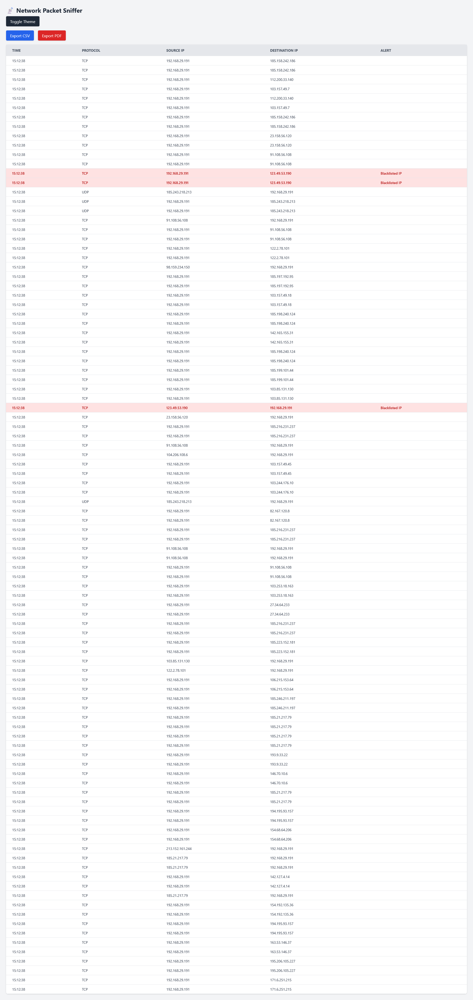
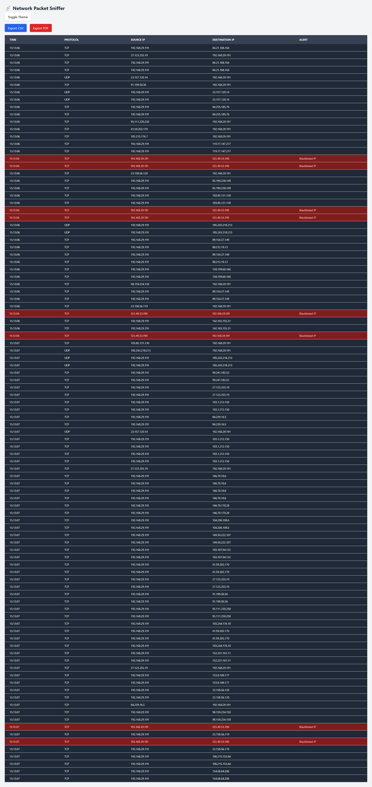

# 🧪 Network Packet Sniffer Dashboard

A real-time Flask-based network packet sniffer that displays live packet data with alerts for suspicious activity. Includes export options for CSV and PDF and supports dark/light UI toggle.

---

## 📸 Screenshots

### 💻 Dashboard (Light Mode)


### 🌙 Dashboard (Dark Mode)


### 📤 Exported PDF


---

## 🚀 Features

- 📡 Real-time packet capture using Scapy
- 🛑 Alert system for blacklisted IPs & suspicious ports
- 📊 TailwindCSS UI (Light/Dark mode toggle)
- 📄 Export packet data to **CSV** and **PDF**
- ♻️ Auto-refresh every 2 seconds

---

## 🛠 Requirements

Install all dependencies using:

```bash
pip install -r requirements.txt

Python 3.8+ recommended.
```
---
## 🔧 How To Run
```bash
python app.py
```
Visit: http://127.0.0.1:5000

---
## 🛡️ Alert Rules

    🔴 Blacklisted IPs (e.g., 123.49.53.190)

    ⚠️ Suspicious Ports (e.g., 31337, 6667)

---

## 📤 Export
| Format    |  Route                            | Output                            |
|-----------|-----------------------------------|-----------------------------------|
| CSV       | /export/csv                       | packets.csv                       |
| PDF       | /export/pdf                       | packet_report.pdf                 |

---

## 🌙 Dark Mode

Toggle theme with the button on top of the dashboard.
Dark mode enabled via TailwindCSS dark: classes.

---

## 👨‍💻 Author

Made with 💻 by Himanshu Choubey

---

## 📜 License

This project is licensed under the [MIT License](LICENSE)

